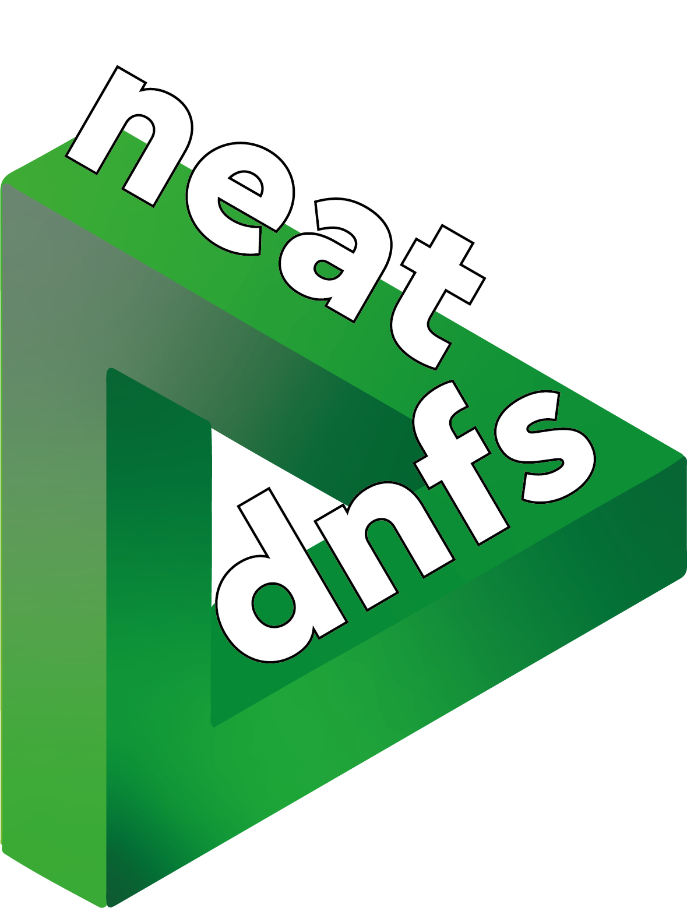

# NEAT-DNFs: Dynamic Neural Field Evolution with NEAT for Robotics



A C++20 library that combines **NEAT** (NeuroEvolution of Augmenting Topologies) with **Dynamic Neural Fields** (DNFs) to automatically evolve interpretable, neurally inspired control architectures for robotics.

---

## Overview

**NEAT-DNFs** combines the representational power of *Dynamic Neural Fields*—neural population dynamics that support perception, working memory, and action selection—with the adaptive search capabilities of *NEAT*, which evolves both parameters and topological structure.

This integration enables fully **automated design and optimization** of DNF-based controllers, removing the need for manual tuning and handcrafted architectures.  
The system supports a range of robotics applications, from low-level perceptual processing to high-level decision-making in human–robot collaboration.

---

- **Automatic Evolution of DNF Architectures**  
  Evolve both topology and intra-field parameters—time constants, kernel shapes, and connectivity.
  
- **Topologically Minimal, Interpretable Solutions**  
  Evolution favors compact yet expressive neural field architectures that can be visualized and understood.
  
- **Simulation-to-Reality Transfer**  
  Evolved controllers transfer directly from simulation to physical robots with no manual re-tuning.
  
- **Comprehensive Statistics & Visualization**  
  Automatic per-generation logging, species tracking, and HTML-based interactive visualizations.

---

## Architecture

### Core Components

| Component | Description |
|------------|-------------|
| **Genome** | Encodes field and interaction genes (neural fields + their connections). |
| **Population** | Manages the evolutionary loop and fitness evaluation. |
| **Species** | Clusters genomes by compatibility distance for diversity preservation. |
| **Solution** | Task-specific fitness function implementation. |
| **Field Genes** | Represent neural fields (input, output, hidden) and DNF parameters such as kernel type, τ, and resting potential *h*. |
| **Interaction Genes** | Represent spatially structured connections between fields. |

---

### Evolutionary Process

1. **Initialization** – Create an initial population of basic architectures.  
2. **Evaluation** – Simulate DNF dynamics and compute behavioral fitness.  
3. **Speciation** – Group similar architectures to protect new innovations.  
4. **Selection** – Choose high-performing parents.  
5. **Reproduction** – Apply crossover and mutation.  
6. **Mutation** – Add/modify fields, connections, or kernel parameters.  

---

## Implemented Solutions

The project includes several pre-implemented robotics solutions:

- **Single Bump**: Basic bump attractor dynamics
- **Self-Sustained Single Bump**: Persistent activation without input
- **Logical Operations**: AND, XOR gate implementations
- **Action Layers**: Simulation and execution layer controllers
- **Selective Output**: Conditional field output mechanisms
- **Timing Response**: Temporal dynamics control
- **Object Selection**: Spatial selection tasks
- **Multi-Robot**: Two robot team coordination

---

## Building

### Prerequisites
- **CMake 3.31.6+**
- **C++20** compiler
- **VCPKG** package manager

**Dependencies (via VCPKG):**
- `imgui`, `implot`, `imgui-node-editor`, `nlohmann-json`

**Manual dependencies:**
- [`imgui-platform-kit`](https://github.com/Jgocunha/imgui-platform-kit)
- [`dynamic-neural-field-composer`](https://github.com/Jgocunha/dynamic-neural-field-composer)

### Build Instructions

```bash
export VCPKG_ROOT=/path/to/vcpkg
mkdir build && cd build
cmake ..
cmake --build . --config Release
```

---

## Usage

### Basic Example

```cpp
#include "neat/population.h"
#include "solutions/xor.h"

XOR solution{ SolutionTopology{{ 
    { {FieldGeneType::INPUT, {50, 1.0}}, 
      {FieldGeneType::INPUT, {50, 1.0}}, 
      {FieldGeneType::OUTPUT, {50, 1.0}} } 
}}};

PopulationParameters parameters{100, 150, 0.95};
Population population{parameters, std::make_unique<XOR>(solution)};
population.initialize();
population.evolve();
```

### Custom Solutions

To implement a custom robotics task:

1. Inherit from `Solution` class
2. Define initial topology in constructor
3. Override `evaluate()` method with task-specific fitness function

```cpp
void evaluate() override 
{
    // Your fitness evaluation logic here
    // Use methods like oneBumpAtPositionWithAmplitudeAndWidth()
    // Set parameters.fitness based on task performance
}
```

---

## Statistics

The system provides comprehensive statistics tracking:

- **Mutation Statistics**: Per-generation and total counts for all mutation types
- **Population Metrics**: Fitness evolution, species diversity, genome complexity
- **Connection Analysis**: Kernel type distribution, parameter evolution
- **Performance Logs**: Detailed evolution progress and best solutions

Statistics are automatically saved to the `data/` directory.

---

## Analysis and Visualization

The `analysis/` folder contains comprehensive analysis tools for post-evolution analysis and visualization of evolutionary results:

### Python Tools (`analysis/`)
- **`analysis-other-statistics.py`** – Aggregate metrics, mutation rates, genome statistics.  
- **`analysis-per-generation-overview.py`** – Generation-wise fitness and diversity tracking.

### Interactive HTML Dashboards
- **`fitness-visualizer.html`** – Real-time fitness tracking and champion evolution.  
- **`species-tree.html`** – Interactive species lineage and extinction visualization.  
- **`phylogenetic-tree.html`** – Genome ancestry and innovation propagation.

---

## Project Structure

```bash
neat-dnfs/ 
├── include/ 
│ ├── neat/ # Core NEAT-DNF classes 
│ ├── solutions/ # Pre-implemented robotics solutions 
│ ├── tools/ # Utilities and logging 
│ └── constants.h # Global constants 
├── src/ # Implementation files 
├── examples/ # Usage examples 
├── tests/ # Unit tests 
├── data/ # Output directory for results 
├── analysis/ # Analysis tools for results
└── CMakeLists.txt # Build configuration
```

---

## References

Key literature:
- K. Stanley & R. Miikkulainen, *Evolutionary Computation*, 2002 — NEAT algorithm  
- W. Erlhagen & E. Bicho, *J. Neural Eng.*, 2006 — Dynamic Neural Field theory  
- E. Bicho et al., *Human Movement Science*, 2011 — DNF in HRI  
- Floreano & Nolfi, *Evolutionary Robotics*, 2000 — Foundational principles 